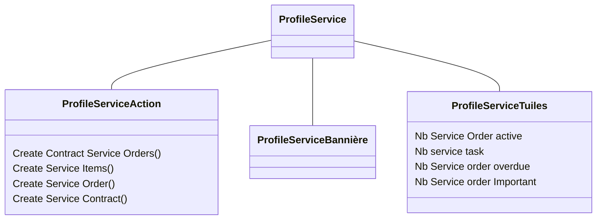

# Solution proposer

Présentement, le profil de base Service n'a pas de Dashboard. Il faudrait pouvoir ajouter des liens dans la section Actions, une bannière ainsi que quelque tuile. 
# Détail Technique

# Estimation

Analyse : 

Développement : 

Test : 
# Control Qualité

|No|Steps|Résultat souhaité|Passer|
|--|--|--|--|
|1|Créer un service ordre|Le numéro sur la tuile Nb Service order active devrais monter||
|2|Fermer un service ordre|Le numéro sur la tuile Nb Service order active devrais descendre||
|3|Changer la date d'un service ordre pour une date passer|Le numéro sur la tuile Nb Service ordre Overdue devrais monté|
|4|Changer la priorité d'un service ordre pour important|Le numéro sur la tuile Nb Service ordre important devrait monté|

